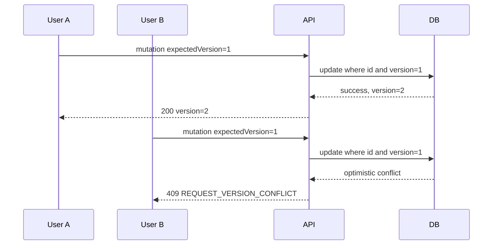

# API behavior matrix

Status: Proposed for TASK-002 Design approval. The machine-readable source is [openapi.yaml](../../contracts/openapi.yaml).

## Permissions

| Operation | Employee owner | Employee non-owner | Approver |
| --- | --- | --- | --- |
| Create DRAFT | allowed; becomes owner | N/A | 403 |
| List | own requests only | cannot expand scope | all requests |
| Detail | allowed | 403 | allowed |
| Edit DRAFT | allowed | 403 | 403 |
| Submit DRAFT | allowed | 403 | 403 |
| Cancel DRAFT/PENDING | allowed | 403 | 403 |
| Approve PENDING | 403 | 403 | allowed |
| Reject PENDING | 403 | 403 | allowed with reason |

Authorization is evaluated before returning request content. A syntactically valid unknown UUID returns 404. Error precedence for an existing resource is identity/role/ownership → expected version → state → business rule; endpoint tests freeze this order so errors do not leak mutable details unexpectedly.

## State transitions

| Current | Edit | Submit | Cancel | Approve | Reject |
| --- | --- | --- | --- | --- | --- |
| DRAFT | owner only | PENDING | CANCELLED | 409 | 409 |
| PENDING | 409 | 409 | CANCELLED | APPROVED | REJECTED |
| APPROVED | 409 | 409 | 409 | 409 | 409 |
| REJECTED | 409 | 409 | 409 | 409 | 409 |
| CANCELLED | 409 | 409 | 409 | 409 | 409 |

## Error mapping

| Status | Stable code examples | Use |
| --- | --- | --- |
| 400 | MALFORMED_REQUEST, VALIDATION_ERROR | JSON/type/header/query/field validation |
| 403 | ACCESS_DENIED | valid demo identity lacks role or ownership |
| 404 | REQUEST_NOT_FOUND | request ID does not exist |
| 409 | REQUEST_VERSION_CONFLICT, REQUEST_STATE_CONFLICT | stale mutation or invalid transition |
| 422 | BUSINESS_RULE_VIOLATION, ITEMS_REQUIRED, REJECTION_REASON_REQUIRED | well-formed request fails business rule |
| 500 | INTERNAL_ERROR | sanitized unexpected failure; no stack trace/PII |

Every error uses timestamp, numeric status, code, message, path and fieldErrors. Item field paths use `items[<index>].<field>`. Frontend maps known paths to inputs and shows a form-level message for unknown paths.

## Concurrency sequence

The API never retries B's intent automatically and never accepts status or owner fields from clients.
