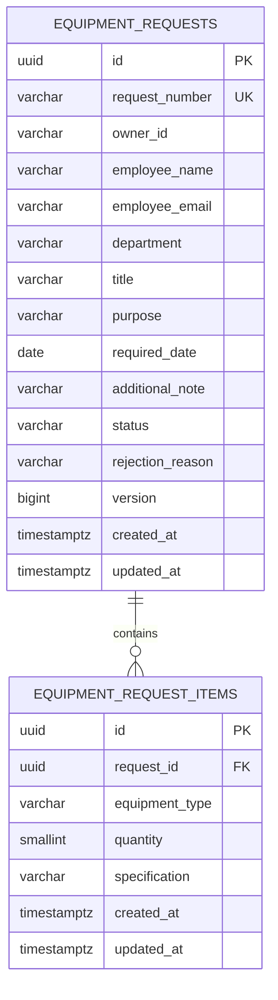

# Equipment request data model

Status: Approved in TASK-002 Design on 2026-09-25
Requirements: REQ-01, REQ-02, REQ-03, REQ-05, REQ-07

## Relationship

## Tables and constraints

### equipment_requests

| Column | Proposed type | Null | Constraint / meaning |
| --- | --- | --- | --- |
| id | UUID | no | application-generated PK |
| request_number | VARCHAR(32) | no | unique; `REQ-{year}-{sequence}` |
| owner_id | VARCHAR(100) | no | derived from `X-User-Id`, never request body |
| employee_name | VARCHAR(100) | no | trimmed length 2–100 |
| employee_email | VARCHAR(254) | no | application validates email syntax |
| department | VARCHAR(100) | no | trimmed nonblank, approved Q-08 limit |
| title | VARCHAR(150) | no | trimmed length 5–150 |
| purpose | VARCHAR(500) | no | trimmed length 10–500 |
| required_date | DATE | no | application compares with Asia/Bangkok business date |
| additional_note | VARCHAR(500) | yes | blank normalized to null |
| status | VARCHAR(16) | no | check DRAFT/PENDING/APPROVED/REJECTED/CANCELLED |
| rejection_reason | VARCHAR(500) | yes | required by domain when status REJECTED; null otherwise |
| version | BIGINT | no | JPA `@Version`, starts 0 and cannot be negative |
| created_at / updated_at | TIMESTAMPTZ | no | application timestamps stored as instants |

Cross-column database check: REJECTED requires nonblank `rejection_reason`; other states require it to be null. Date-not-in-past remains application validation because today's date changes and old valid records must remain readable.

### equipment_request_items

| Column | Proposed type | Null | Constraint / meaning |
| --- | --- | --- | --- |
| id | UUID | no | application-generated PK |
| request_id | UUID | no | FK → equipment_requests(id), ON DELETE CASCADE |
| equipment_type | VARCHAR(16) | no | check approved equipment enum |
| quantity | SMALLINT | no | check 1–5 |
| specification | VARCHAR(250) | yes | blank normalized to null |
| created_at / updated_at | TIMESTAMPTZ | no | audit timestamps |

Submit's “at least one item” rule is enforced by the transactional domain use case because a row-level check cannot safely assert child existence. Any item replacement must mutate the parent so optimistic version increments even when only children change.

## Number allocation

PostgreSQL sequence `equipment_request_number_seq` is global and non-transactional. The application reads `nextval`, gets the current business year in Asia/Bangkok and formats at least six digits. Gaps after rollbacks are accepted; sequence does not reset each year. The unique constraint is the final collision defense.

## Index plan

| Index | Purpose |
| --- | --- |
| unique(request_number) | exact lookup and uniqueness |
| `(owner_id, created_at DESC, id DESC)` | Employee scoped list |
| `(status, created_at DESC, id DESC)` | Approver status filter |
| `(department, created_at DESC, id DESC)` | department filter |
| `(request_id)` on items | FK join/delete and totals |
| GIN trigram on request_number/title/employee_name | case-insensitive contains keyword search |

The first migration enables `pg_trgm`; deployment must provide extension permission. TASK-005 records `EXPLAIN ANALYZE` for combined queries before cache work. Total quantity should use an aggregate/projection without N+1 item loading.

## Transaction and concurrency boundary

- create/update request and replacement items execute in one transaction
- mutation loads request within the actor scope, verifies expected version and state, applies changes and flushes before returning
- optimistic lock exceptions raised at flush/commit map to 409; transaction rollback leaves request/items/cache publication unchanged
- request-number gaps and rolled-back database sequence values are expected
- cache changes publish only after commit; database remains authoritative for authorization, status and version

## Migration and rollback design

TASK implementation will create a versioned Flyway migration containing extension, sequence, tables, checks and indexes. Verification uses an empty PostgreSQL database, reruns application startup without schema changes and queries catalog constraints/indexes. Early development rollback may drop the disposable local database; released schema changes use forward-fix or a rehearsed restore plan rather than an assumed automatic down migration.
