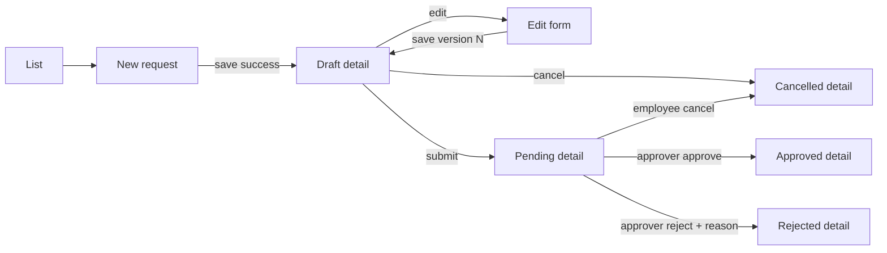

# Frontend interaction design

Status: Proposed for Design approval

## Routes

| Route | Purpose | Access |
| --- | --- | --- |
| `/requests` | list/search/filter/page and contextual actions | Employee own scope; Approver all |
| `/requests/new` | create DRAFT | Employee |
| `/requests/{id}` | read detail and available actions | Employee owner; Approver |
| `/requests/{id}/edit` | edit DRAFT | Employee owner |

A demo identity control selects a predefined `X-User-Id` and `X-Role`. Changing identity clears scoped server state and navigates to `/requests`; it does not represent real authentication.

## User flows

## Form state

- React Hook Form + Zod is the proposed form/validation pair; TanStack Query is proposed for server state. These library choices become binding only through Design approval.
- Form owns editable values and dirty/touched/errors; query cache owns fetched request data. Status, totalItems and available actions are derived rather than duplicated state.
- Dynamic item rows use stable client keys independent of persisted item IDs.
- While save/action is pending, its control is disabled and repeated submission is ignored. Other destructive navigation is also guarded as needed.
- Failed API calls retain values. `fieldErrors` map to scalar or `items[index].field`; unmapped errors appear in a form summary.
- On successful create/update, the form resets its baseline to the returned server version before navigation/refetch.
- A 409 never resubmits or overwrites automatically. Show a conflict message and an explicit “reload latest” action; dirty input remains until the user chooses.
- Dirty navigation uses in-app route guarding where supported plus `beforeunload` for browser close/refresh. Tests cover behavior rather than browser-specific implementation.

## List and request races

- URL is the source for keyword/status/department/page/size/sort. Changing keyword/filter resets page to 0.
- Keyword is debounced; query identity includes actor and all URL parameters. AbortSignal or query cancellation prevents old responses from replacing newer results.
- UI renders loading, error, empty and success states. Previous page data may remain visible during paging only if marked loading and never mixed with a different actor.
- Actions are derived from role + ownership + status. Hiding an action is convenience; backend remains authoritative.

## Action presentation

| Status | Employee owner | Approver |
| --- | --- | --- |
| DRAFT | View, Edit, Submit, Cancel | View |
| PENDING | View, Cancel | View, Approve, Reject |
| APPROVED | View | View |
| REJECTED | View | View |
| CANCELLED | View | View |

Reject uses a dialog with required reason. Every action sends the displayed version, shows pending state and replaces/refetches detail/list data from the response after success.

## Accessibility baseline

Fields have programmatic labels and error descriptions; status is text in addition to color; dialogs manage focus; loading and action results are announced; keyboard users can add/remove item rows and complete every workflow.
